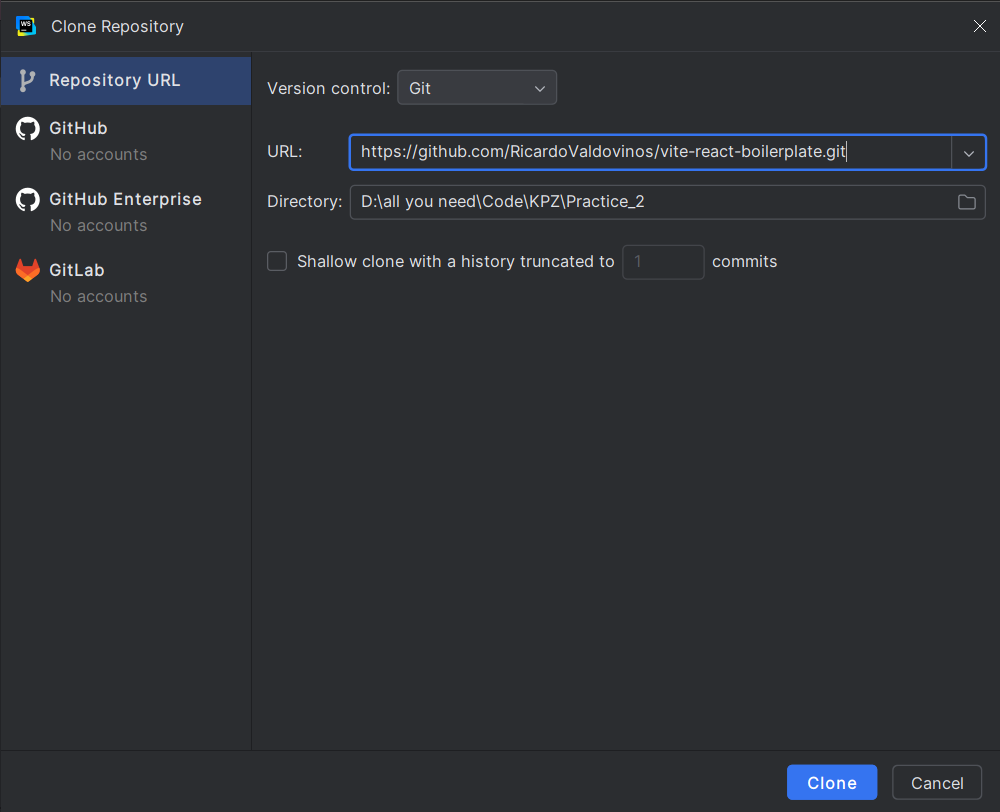
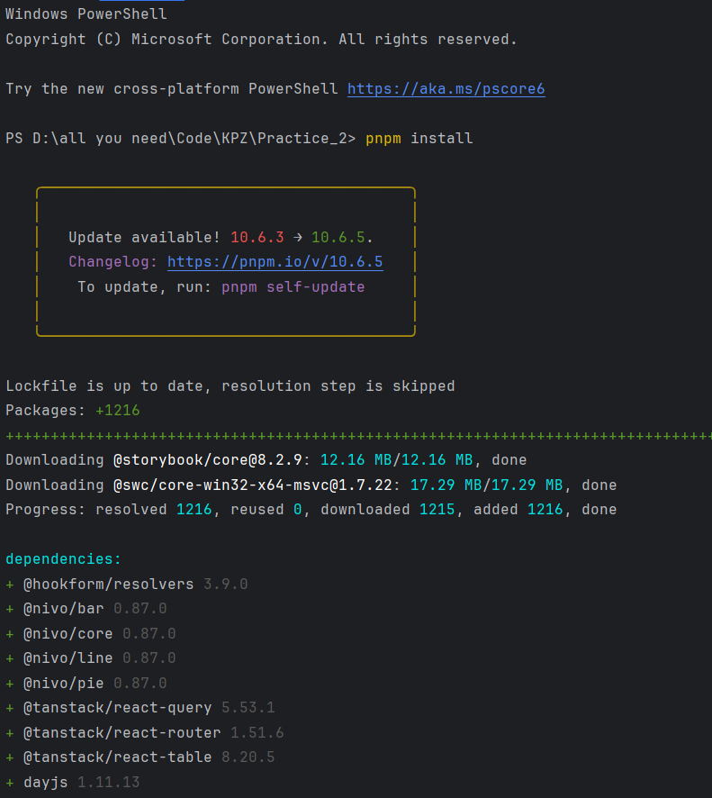
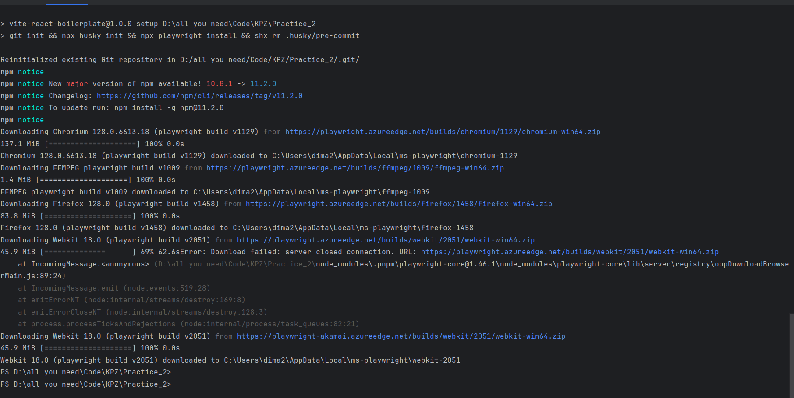
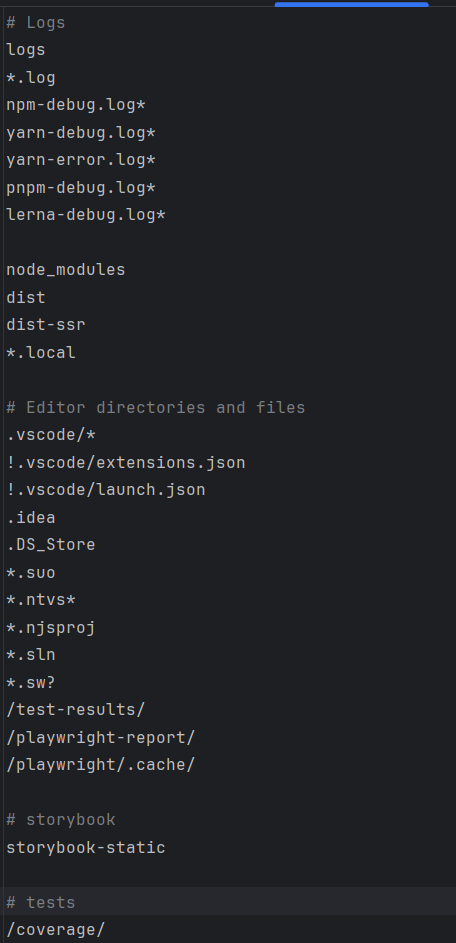
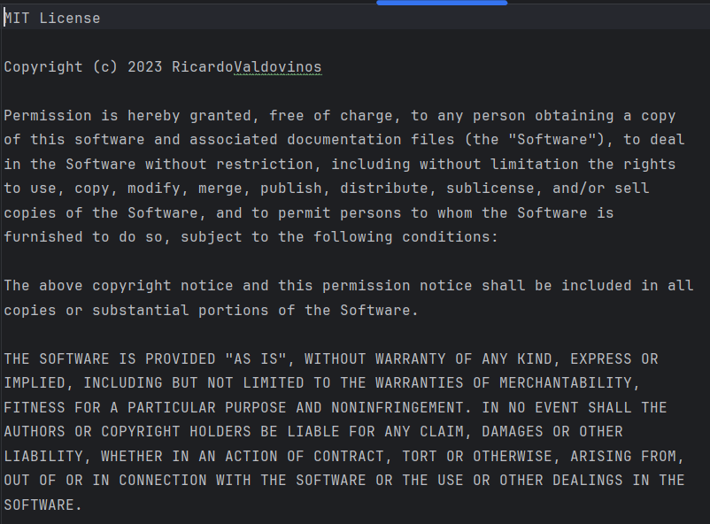

# KPZ-Pr_2
# Афанасьєв Михайло ІПЗ 3.02
# Практичне заняття №2
## Тема: Комплексне дослідження структури, конфігурацій та робочого середовища сучасного JavaScript-проєкту на основі бойлерплейта ```vite-react-boilerplate```
## Мета:
- Познайомитись із структурою файлу ```package.json``` як центрального конфігураційного файлу JavaScript-проєкту, зрозуміти основні поля: імʼя, автор, опис, версія, ліцензія, репозиторій, скрипти та залежності.
- Вивчити принципи семантичного версіонування (SemVer) через аналіз реальних залежностей.
- Ознайомитись із практикою оформлення проєктної документації (```README.md```).
- Вивчити призначення файлів ```.gitignore``` та ```LICENSE```.
- Розібратися з роботою гіт-хуків через аналіз артефактів, які створює бібліотека Husky.
## Завдання
## Завдання 1: Початкова підготовка середовища
1 Склонуйте репозиторій [```vite-react-boilerplate```](https://github.com/RicardoValdovinos/vite-react-boilerplate).
### Результат



2 Встановіть усі залежності проєкту, використовуючи команду ```pnpm install```.

У терміналі написав команду ```pnpm install``` аби встановити усі залежності.
### Результат


3 Запустіть початковий скрипт сетапу проєкту (```pnpm run setup```).

У терміналі написав команду ```pnpm run setup``` аби запустити початковий скрипт сетапу.
### Результат


## Завдання 2: Аналіз структури файлу ```package.json```
1 Опишіть у звіті призначення полів файлу ```package.json```: ```name```, ```author```, ```description```, ```version```, ```license```, ```repository```, ```scripts```, ```dependencies```, ```devDependencies```.

- Поле ```name``` надає нам назву пакету, яке використовується для ідентифікації в npm реєстрі.
- Поле ```author``` - містить інформацію про розробника пакету.
- Поле ```description``` - короткий опис пакету, що допомагає іншим розробникам зрозуміти його призначення.
- Поле ```version``` - поточна версія пакету, зазвичай у форматі семантичного версіонування (major.minor.patch).
- Поле ```license``` - тип ліцензії, під якою розповсюджується пакет (наприклад, "MIT", "ISC", "GPL-3.0").
- Поле ```repository``` - інформація про репозиторій коду, де зберігається проект. Зазвичай містить тип (```git```, ```svn```) та URL.
- Поле ```scripts``` - набір команд, які можна запускати через npm (```npm run [script-name]```). Часто включає команди для запуску, тестування і збірки проекту.
- Поле ```dependencies``` - зовнішні пакети, необхідні для роботи проекту в продакшені.
- Поле ```devDependencies``` - зовнішні пакети, необхідні тільки для розробки та тестування, але не для роботи готового проекту.

2 Проаналізуйте залежності, вказані у ```dependencies``` та ```devDependencies```, поясніть логіку такої класифікації.

Класифікація на ```dependencies``` та ```devDependencies``` ґрунтується на важливому принципі: розділення пакетів, необхідних для роботи додатку в продакшені, від пакетів, потрібних лише під час розробки.

## ```dependencies```

Тут зібрані бібліотеки, які потрібні для безпосередньої роботи додатку в продакшені:
- UI та компоненти візуалізації даних:
  - ```@nivo/bar```, ```@nivo/core```, ```@nivo/line```, ```@nivo/pie``` - бібліотеки для створення різних типів графіків і діаграм.
- ```react``` і ```react-dom``` - ядро React для побудови користувацького інтерфейсу.
- Управління станом і запитами:
  - ```@tanstack/react-query``` - для керування запитами до API
  - ```zustand``` - легка бібліотека для управління станом додатку
- Маршрутизація та таблиці:
  - ```@tanstack/react-router``` - для навігації по додатку
  - ```@tanstack/react-table``` - для створення таблиць
- Форми і валідація:
  - ```react-hook-form``` - для роботи з формами
  - ```@hookform/resolvers``` і ```zod``` - для валідації даних форм
- Інтернаціоналізація:
  - ```i18next``` і пов'язані пакети - для багатомовності додатку
- Утиліти:
  - ```dayjs``` - для роботи з датами

## ```devDependencies```

Ці інструменти використовуються лише в процесі розробки, тестування та збірки:
- Інструменти збірки проекту:
  - ```vite``` і плагіни до нього - для збірки застосунку
  - ```typescript``` - для типізації коду
  - ```tailwindcss```, ```postcss```, ```autoprefixer``` - для стилізації
- Лінтинг та форматування:
  - ```eslint``` і багато його плагінів - для аналізу коду
  - ```prettier``` - для форматування коду
- Тестування:
  - ```vitest```, ```@testing-library/*```, ```@playwright/test``` - для різних типів тестів
- Розробка компонентів:
  - ```storybook``` і його плагіни - для ізольованої розробки UI компонентів
- Інструменти для розробників (```Dev tools```):
  - ```@tanstack/react-query-devtools```, ```@hookform/devtools``` - спеціальні інструменти для налагодження
- Керування Git-комітами та хуками:
  - ```husky```, ```commitizen```, ```@commitlint/*``` - для стандартизації комітів
- Допоміжні бібліотеки для розробки:
  - ```@faker-js/faker``` - для генерації тестових даних
  - ```@headlessui/react```, ```@heroicons/react``` - UI компоненти для розробки

Переваги такого розподілу:

1 Зменшення розміру продакшн-збірки

2 Підвищення безпеки

3 Краща організація проекту

## Завдання 3: Семантичне версіонування (SemVer)
1 Ознайомтесь із [принципами SemVer](https://semver.org/).

2 Дослідіть версії пакетів бойлерплейту. Поясніть, які оновлення (мажорні, мінорні, патчі) допускаються відповідно до версій, зазначених у файлі ```package.json```.

Більшість пакетів використовують префікс ^ (карет), що дозволяє:
- Автоматичні оновлення MINOR і PATCH версій
- Блокування MAJOR оновлень

Наприклад:
- ```"react": "^18.3.1"``` - дозволені версії від 18.3.1 до 19.0.0 (не включно)
- ```"zod": "^3.23.8"``` - дозволені версії від 3.23.8 до 4.0.0 (не включно)

Декілька пакетів (vite, vitest) вказані з точною версією без префікса:
- ```"vite": "5.4.2"``` - дозволена тільки версія 5.4.2

Такий підхід дозволяє автоматично отримувати виправлення помилок і нові функції, але захищає від потенційно несумісних MAJOR оновлень.

# Завдання 4: Дослідження додаткових конфігураційних файлів
Проаналізуйте та опишіть призначення, структуру та важливі елементи файлів:
- ```README.md```
- ```.gitignore```
- ```LICENSE```

## ```README.md```
Призначення: Документація проекту

Ключові елементи: Опис проекту, інструкції з встановлення, використання, вимоги, приклади коду

Важливість: Перше джерело інформації для нових користувачів і розробників



## ```.gitignore```
Призначення: Визначає файли, які не відстежуються Git

Ключові елементи: node_modules/, dist/, .env, .log, .DS_Store

Важливість: Запобігає додаванню тимчасових, конфіденційних та згенерованих файлів у репозиторій



## ```LICENSE```
Призначення: Визначає юридичні умови використання проекту

Ключові елементи: Тип ліцензії, авторські права, умови, обмеження

Важливість: Регулює як інші можуть використовувати, змінювати та розповсюджувати код


# Завдання 5: Аналіз роботи гіт-хуків Husky
1 Дослідіть артефакти, які створюються після встановлення та налаштування бібліотеки Husky.

Директорія .husky/:
- Директорія ```_/``` - службова директорія Husky, що містить допоміжні скрипти
- Файл ```commit-msg``` - скрипт, який перевіряє формат повідомлень комітів (зазвичай використовується з ```commitlint```)
- Файл ```prepare-commit-msg``` (позначений як ```prepare*commit_msg```) - скрипт, який виконується перед редагуванням повідомлення коміту


Ці артефакти дозволяють:
- ```commit-msg``` - забезпечувати дотримання єдиного стилю повідомлень комітів (наприклад, згідно з Conventional Commits)
- ```prepare-commit-msg``` - автоматично форматувати повідомлення коміту або додавати до нього інформацію (як-от номер задачі з трекера)

Директорія ```_/``` містить shell-скрипти, які забезпечують коректну роботу git-хуків, незалежно від операційної системи та середовища.

2 Опишіть, для чого потрібні ці артефакти, як вони налаштовуються та яку роль відіграють у процесі розробки.

- ```.husky/_/``` – службова директорія
   - Містить внутрішні скрипти Husky, необхідні для виконання хуків.
   - Автоматично створюється та не потребує змін.

- ```commit-msg``` – перевірка повідомлення коміту
   - Використовується для перевірки формату комітів (наприклад, з ```commitlint```).
   - Забезпечує узгодженість стилю комітів.

- ```prepare-commit-msg``` – підготовка повідомлення коміту
   - Виконується перед редагуванням коміту, дозволяє автоматично змінювати повідомлення.
   - Може додавати мета-інформацію (наприклад, номер задачі).

Роль у розробці: автоматизує Git-хуки, допомагає підтримувати якість коду та структуру комітів.

# Завдання 6: Використання змінних оточення

1 Напишіть скрипт, який буде читати довільну змінну оточення та друкувати її значення у консоль.

2 Задайте різне значення змінної оточення на різних рівнях (ОС, сесія терміналу, окремий запуск скрипта, dotEnv файл) та дослідіть пріоритетність їх застосування.

3 Зафіксуйте отримані результати. 

У нас є файл ```env__variebles.js```


Tепер запустимо файл за допомогою команди ```node ./env__variebles.js```
### Результат


Для рішення проблеми напишемо команду ```pnpm add dotenv```, що встановить бібліотеку ```dotenv```, яка дозволяє працювати з файлом ```.env```


Тепер запустимо наш скрипт
### Результат


Як бачимо усе запустилось, і усе прийнялось за дефолтом. Тепер буде задавати і перевіряти у різні рівні змінних оточення:
- Окремий запуск скрипта


- Cесія терміналу


- На рівні ОС
Був написан ```bash``` скрипт у якому були написані змінні які потрібно було вивести:
```PORT=6000, API_KEY=my_secret_key, ENVIRONMENT=production```


- ```dotEnv``` файл
У файлі ```.env``` додав рядок ```PORT=5000``` і запустив файл ```env__variebles.js```


# Висновок
У результаті дослідження структури проєкту vite-react-boilerplate було вивчено важливі аспекти конфігурації та роботи з проєктами:

1 Файл package.json містить ключову інформацію про проєкт, залежності та скрипти.

2 Семантичне версіонування (SemVer) допомагає позначати зміни в залежностях.

3 Документація (README.md) важлива для зручності використання проєкту.

4 Файли .gitignore та LICENSE визначають, які файли і ліцензії включати в репозиторій.

5 Husky автоматизує виконання перевірок через гіт-хуки.

6 Також було досліджено використання змінних оточення: змінні можуть задаватися на різних рівнях (ОС, сесія терміналу, запуск скрипта, .env файл). Пріоритетність їх застосування така:

- Значення змінної, задане під час окремого запуску скрипта, має найвищий пріоритет.

- Потім йде сесія терміналу.

- Файл .env наступний за пріоритетом.

- І, нарешті, значення на рівні ОС використовується, якщо інші джерела не визначають змінну.

Ці аспекти допомогли краще зрозуміти принципи налаштування та роботи з сучасними JavaScript-проєктами.

